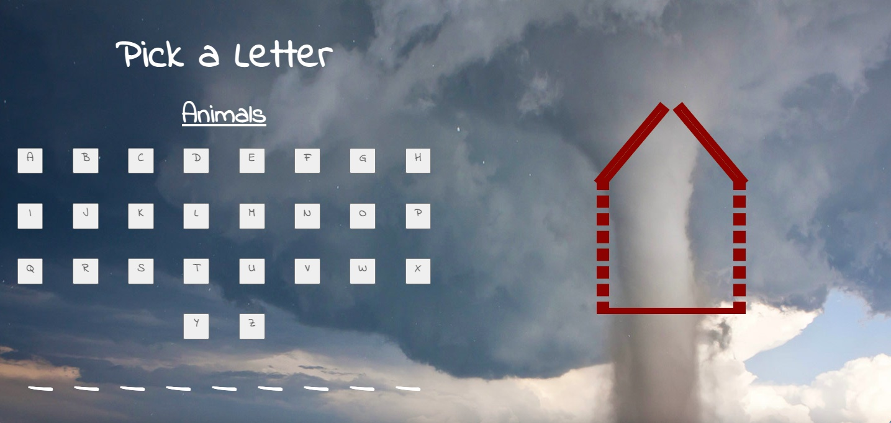

# Tornado

## Date: 7/4/2022

### By: Emily Byrne

#### [LinkedIn](https://www.linkedin.com/in/emilybyrne3/) | [GitHub](https://github.com/embyrne13)

---

### **_Description_**

#### A rendition of Hangman but instead a tornado is coming and the player must try to save their house by guessing the right word

---

### **_Technologies_**

- HTML
- CSS
- Javascript
- GitHub
- VSCode
- Google Fonts
- [Trello](https://trello.com/b/WNqtNdz6/project-1)

---

### **_Getting Started_**

---

The name of the game is Tornado. Tornado is a word game where you have 5 chances to guess the word. Each time you guess a wrong letter, you lose a part of your house. If you don't get the word in time, a tornado will known your house down. Good luck!

### **_Screenshots_**

---

### **_Future Updates_**

- [x] Create house
- [x] Set house to lose line with each wrong guess
- [x] Set to 5 guesses
- [x] Have letters fade out when guessed
- [x] Create dotted lines for the letters to go into
- [x] Create list of words
- [x] Style with CSS
- [x] Setup win screen
- [x] New game button

---

### **_Credits_**

--- [Background Image](https://www.amnh.org/var/ezflow_site/storage/images/media/tornado-leading-image/1666587-1-eng-US/tornado-leading-image.jpg)
